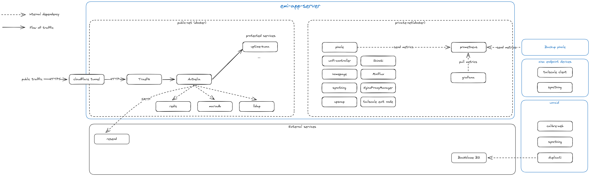

## homelab
This is a small diagram of my homelab as it exists today.

last-updated: 2024-10-10

# Public service hosting
- Bare metal: e-waste HP desktop running Docker compose on Ubuntu 22.04
- DNS: Cloudflare
- Reverse proxy #1 & TLS termination: cloudflared (cloudflare tunnel)
- Reverse proxy #2: Traefik
- SMTP: Resend
- SSO: Authelia
- LDAP: lldap
- Uptime monitor: Uptime kuma
- Target services: none yet :)

